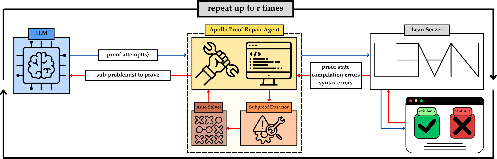

# Apollo Repair Framework

## Overview 

The codebase implements the Apollo framework, which uses an agentic approach to repair Lean4 code. It supports whole-proof generation models and integrates with Lean compiler via Lean REPL. For a full description of the framework and detailed algorithms, see our paper [“APOLLO: Automated LLM and Lean Collaboration for Advanced Formal Reasoning”](https://arxiv.org/abs/2505.05758) on arXiv.




## Evaluation Results
According to our evaluation results, Apollo improves the accuracy of modern theorem provers while sampling less proofs from the LLMs.
| Method                                    | Model Size | Sample Budget | Token Count | miniF2F-test   |
|-------------------------------------------|------------|---------------|-------------|----------------|
| o3-mini                                   | -          | 32            | -           | 24.6%          |
| o4-mini                                   | -          | 1             | -           | 7.0%           |
| Goedel-Prover-SFT                         | 7B         | 25600         | 12.7M       | 64.7%          |
| Kimina-Prover-Preview-Distill-7B          | 7B         | 1024          | 4.5M        | 70.8%          |
| Goedel-V2-8B                              | 8B         | 32            | 168K        | 83.3%          |
| o3-mini + Apollo                          | -          | 8             | -           | 40.2% (+36.9%) |
| o4-mini + Apollo                          | -          | 15            | -           | 46.7% (39.7%)  |
| Goedel-SFT + Apollo                       | 7B         | 362           | 179K        | 65.6% (+0.9%)  |
| Kimina-Prover-Preview-Distill-7B + Apollo | 7B         | 307           | 1.3M        | 75.0% (+4.2%)  |
| Goedel-V2-8B + Apollo                     | 8B         | **63**            | **403K**        | **84.9% (+1.6%)**  |

## Requirements
- Supported platform: Linux
- Python 3.10
- The recommended Lean version is 4.17.0 (supplied with this codebase). 

## Installation

1. **Install Lean 4**

   Follow the instructions on the [Lean 4 installation page](https://leanprover.github.io/lean4/doc/quickstart.html) to set up Lean 4.

2. **Clone the repository**

```sh
git clone --recurse-submodules git@github.com:aziksh-ospanov/APOLLO.git
cd APOLLO
```

3. **Install dependencies**

```sh
pip install -r requirements.txt
```

4. **Build Mathlib4**

```sh
cd repl
lake clean
lake update
lake build
```

## Usage 
You can use the Apollo repair as follows:
```python
import os
from apollo import ApolloRepair

code = '''
import Mathlib
import Aesop

set_option maxHeartbeats 0

open BigOperators Real Nat Topology Rat

theorem mathd_algebra_141 (a b : ℝ) (h₁ : a * b = 180) (h₂ : 2 * (a + b) = 54) :
    a ^ 2 + b ^ 2 = 369 := by
  have h3 : a + b = 27 := by
    field_simp [h₂]
  have h4 : (a + b) ^ 2 = 729 := by
    rw [h3]
    norm_num
  have expand : a ^ 2 + b ^ 2 = (a + b) ^ 2 - 2 * a * b := by
    ring
  have step1 : a ^ 2 + b ^ 2 = 729 - 2 * a * b := by
    rw [expand, h4]
  have step2 : 729 - 2 * a * b = 729 - 360 := by
    rw [h₁]
  have step3 : 729 - 360 = 369 := by
    norm_num
  exact step1.trans (step2.trans step3)
'''


# Parameters
max_attempts = 2 # maximum recursion depth
config = 'configs/baseline_sampling_kimina_prover.py' # config file for LLM
problem_dir = 'logs/test' # where to save final lean file and intermediate proof states

# Instantiate the Apollo repair object
manager = ApolloRepair(
    code=code,
    lemma_name='test',
    config=config,
    rec_depth=max_attempts,
    log_dir = problem_dir
)

# Run the entire fix/verify pipeline and get the final assembled proof path
final_proof_path = manager.run()

with open(final_proof_path, 'r') as f:
    proof = f.read()
print(proof)

'''
Final output should look like this:

import Mathlib
import Aesop
set_option maxHeartbeats 0
open BigOperators Real Nat Topology Rat
set_option pp.instanceTypes true
set_option pp.numericTypes true
set_option pp.coercions.types true
set_option pp.letVarTypes true
set_option pp.structureInstanceTypes true
set_option pp.instanceTypes true
set_option pp.mvars.withType true
set_option pp.coercions true
set_option pp.funBinderTypes true
set_option pp.piBinderTypes true
theorem mathd_algebra_141 (a b : ℝ) (h₁ : a * b = 180) (h₂ : 2 * (a + b) = 54) :
    a ^ 2 + b ^ 2 = 369 := by
    have h3 : a + b = 27 := by
        linarith
    have h4 : (a + b) ^ 2 = 729 := by
        rw [h3]
        norm_num
    have expand : a ^ 2 + b ^ 2 = (a + b) ^ 2 - 2 * a * b := by
        ring
    have step1 : a ^ 2 + b ^ 2 = 729 - 2 * a * b := by
        rw [expand, h4]
    have step2 : 729 - 2 * a * b = 729 - 360 := by
        linarith
    have step3 : 729 - 360 = 369 := by
        norm_num
    linarith
'''
```
We save the repaired theorem as a Lean file. Refer to config file to change the base LLM.

## Evaluation Datasets
We provide the evaluation datasets as JSONL files in the datasets directory. Each entry includes an `informal_statement` for the natural-language problem description and a `formal_statement` for the corresponding Lean4 formulation.

## Troubleshooting REPL
On rare occasions, the built REPL may stop compiling proofs, for example, after GPU cluster changes or a system reboot. To test whether REPL works, we supply `test_repl.py` script. 

If REPL is set up correctly, you should see following message:
```python
{'sorries': [{'proofState': 0, 'pos': {'line': 16, 'column': 2}, 'goal': 'x y z w : ℕ\nht : 1 < x ∧ 1 < y ∧ 1 < z\nhw : 0 < w\nh0 : logb ↑x ↑w = 24\nh1 : logb ↑y ↑w = 40\nh2 : logb (↑x * ↑y * ↑z) ↑w = 12\n⊢ logb ↑z ↑w = 60', 'endPos': {'line': 16, 'column': 7}}], 'tactics': [],
 'errors': [], 'warnings': [{'severity': 'warning', 'pos': {'line': 8, 'column': 8}, 'endPos': {'line': 8, 'column': 24}, 'data': "declaration uses 'sorry'"}],
'infos': [], 'system_messages': '', 'system_errors': None, 'ast': {},
'verified_code': 'import Mathlib\nimport Aesop\n\nset_option maxHeartbeats 0\n\nopen BigOperators Real Nat Topology Rat\n\ntheorem aime_1983_p1_alt\n  (x y z w : ℕ)\n  (ht : 1 < x ∧ 1 < y ∧ 1 < z)\n  (hw : 0 < w)\n  (h0 : Real.logb x w = 24)\n  (h1 : Real.logb y w = 40)\n  (h2 : Real.logb (x * y * z) w = 12) :\n  Real.logb z w = 60 := by\n  sorry\n',
'pass': True, 'complete': False, 'verify_time': 11.440606832504272}
```
REPL should output `True` in the `pass` cell. If `pass` is False or is missing from the output, it means that REPL is not running. Usually, rebuilding the REPL resolves the issue; however, if it does not, follow these steps:

```sh
cd repl
lake clean
lake update
lake build
```
Cleaning and updating the Lean REPL typically fixes all problems. This repository is configured for Lean 4.17.0. To update the REPL version, please refer to the [Lean REPL repository](https://github.com/leanprover-community/repl).

## Bibtex Citation
```bibtex
@misc{ospanov2025apolloautomatedllmlean,
      title={APOLLO: Automated LLM and Lean Collaboration for Advanced Formal Reasoning}, 
      author={Azim Ospanov and Farzan Farnia and Roozbeh Yousefzadeh},
      year={2025},
      eprint={2505.05758},
      archivePrefix={arXiv},
      primaryClass={cs.AI},
      url={https://arxiv.org/abs/2505.05758}, 
}
```


